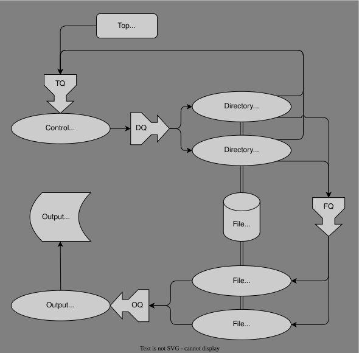

# DirWalkers - Parallelized directory walking and processing

DirWalkers allows parallelized walking and processing of directory trees.  It is
primarily intended for collecting file inventories.  The work is performed by
"agents" with intermediate and final results passed through "queues".  Agents
can be in-process `Task`s (which will run on multiple threads, if available) or
external worker processes setup via `Distributed.jl`.  Queues can be in-process
`Channel`s (for use with in-process `Task`-based agents) or `RemoteChannel`s
(for use with agents running in external worker processes).

# DirWalker architecture

`DirWalkers` uses three types of agents and four queues.  A block diagram of the
`DirWalkers` architecture is shown here and described below.

## Agent types

The three types of agents are:

1. Control agent
2. Directory agent
3. File agent

Agents perform actions.  The control agent is a single internal `Task` that runs
in the main process.  Directory and file agents can be in-process `Task`s or
external worker processes.  All agents run concurrently.  Usually multiple
directory and file agents are used to process the directory walk in parallel.
Agents run a loop until the agent's exit condition is met.

## Queues

The four queues are:

1. Directory queue (DQ) TODO Rename to Top queue (TQ)?
2. Work queue (WQ) TODO Rename to Directory queue?
2. File queue (FQ)
3. Output queue (OQ)

The directory, work, and file queues are `Channel`s or `RemoteChannel`s that
contain `String`s.  The output queue can hold a user-supplied type or `Nothing`
(to signal the end of data).

## Theory of operation

The `run_dirwalker` function orchestrates the life cycle of the directory
walker.  It is responsible for starting the agents, detecting completion of the
directory walk, stopping the agents, and fetching runtime statistics from the
agents.  The user must pass one or more top level directory names for walking.

### Control agent

The control agent is managed internally by `run_dirwalker`.  It is the primary
driver of the directory walking process.  The control agent takes directory
names from the directory queue and puts them into the work queue.  A "posted"
counter is incremented for each directory name put into the work queue.  Getting
an empty string from the directory queue signifies the completion of an earlier
posted directory.  For each empty string taken from the directory queue a
"completed" counter is incremented.  The directory walk is done when the
"completed" counter equals the "posted" counter.  The directory queue is
initially populated with the top level directory names, but aditional
(sub-)directories are added to the directory queue by the directory agents as
they process the directories taken from the work queue.

### Directory agents

Directory agents run a loop.  For each iteration, they take a
directory name from the directory queue.  The entries of the directory are read.
Each entry that is a directory is added to the directory queue.  Each entry that
is a file is added to the file queue, otherwise it is ignored.  To avoid loops
and other potential problems, symbolic links are also ignored.  Users can
provide directory and file *predicate functions* (i.e. functions that returns
`true` or `false`) to process only directories and files for which the
corresponding predicate function returns `true`.  By default, all directories
and files are processed.  Directory agents run until they take an empty String
from the directory queue.

### File agents

File agents run a loop.  For each iteration they take a filename from the
file queue.  The file name is passed to a user-supplied *file function* that is
expected to do something with the file and return an iterator that yields
data from (or about) the file.  Even if a single object is derived from the
file, it must be returned as an iterator (e.g. wrapped in a `tuple`).  For
example, `stat`, which returns a `StatStruct`, is not directly suitable as a
DirWalker file function, but the anonymous function `f->tuple(stat(f))` or the
composed function `tuple∘stat` would be.  The values yielded by the returned
iterator are put into the output queue.  The output queue must be created to
hold a type that is compatible with the type of data yielded by the iterator
returned by the file function.  The motivation for returning an iterator from
the file function is to allow file functions the option of partitioning large
per-file data objects (e.g. large Vectors) into smaller pieces to limit memory
consumption in the output queue.  File agents run until they take an empty
String from the file queue.

# Running a directory walker

A directory walk is performed by calling the `run_dirwalker` function:

    run_dirwalker(filefunc, dirq, workq, fileq, outq, topdirs, args...;
        dirpred=_->true, filepred=_->true, dagentspec=1, fagentspec=1,
        extraspec=nothing, kwargs...)

## Arguments

- `filefunc` - The function that will produce an output value for each file.
  Its first argument must take the filename.  Any additional `args` and `kwargs`
  passed to `run_dirwalker` will be passed to `filefunc` as well.
- `dirq` - The directory queue
- `workq` - The work queue
- `fileq` - The file queue
- `outq` - The output queue
- `topdirs` - A Vector of directory names to be walked
- `dirpred` - The directory predicate function (default matches all directories)
- `filepred` - The file predicate function (default matches all files)
- `dagentspec` - This is the directory agent specification, see below
- `fagentspec` - This is the file agent specification, see below
- `extraspec` - This is an optional extra file specification, see below

### Agent specifications

The agent specifications can be given in two forms.  If given as a single
integer, the agent specification is treated as the number of (in-process)
`Task`s to run as agents.  If given as a Vector of integers, they are treated
as worker process IDs as returned by `Distributed.addprocs`.  It is important
that the agent specification is compatible with the corresponding queue.  If the
directory agents are to run as in-process Tasks, then `dagentspec` must be given
as a single integer and `dirq` must be a `DirQueue` (i.e. a `Channel{String}`).
If the directory agents are to run as external worker processes, then
`dagentspec` must be given as a Vector of the workers' process IDs (i.e.
integers) and `dirq` must be a `RemoteDirQueue`.  For `fagentspec`, the same
constraints apply for `fileq` and `outq`.

`extraspec` is an optional specification for additional file agents that will be
started after the directory agents finish.  It must be in the same format as
`fagentspec`.  This is useful when one host will be running the directory agents
in-process and other hosts will be running the file agents remotely.  To utilize
the host resources that the directory agents had been using, additional
out-of-process-but-still-on-the-same-host file agents can be activated.

### Distributed considerations

When using remote workers, it is imperative that they all load `DirWalkers` and
all have the file predicate and file function defined.  Usually this can be
accomplished using `@everywhere` after the workers have been started.

When using extra out-of-process worker processes via `extraspec`, these worker
processes must be started alongside the other file agent worker processes before
calling `run_dirwalker` even though they will not be active until the directory
agents finish.

Often the directory and file agents have access to the same (possibly
distributed) filesystem(s).  In this case any file agent can process a file from
any directory agent.  In other cases, not all directory and file agents will
have equal access to the same filesystem (e.g. local filesystem on remote worker
hosts).  In these cases, `run_dirwalker` may be run in parallel on multiple
remote workers (or less likely in Tasks).  When operating in this "silo" mode,
be sure to use a separate `dirq`, `fileq`, and `topdirs` for each
`run_dirwalker` call and that the directory and file agents all have access to
the same filesystem(s).  When running in "silo" mode with a single common
`outq`, be sure to keep taking items out of `outq` until you get one `nothing`
value for each `run_diralker` call.

## Return value

The `run_dirwalker` function returns two Vectors of named tuples, one for the
directory agents and one for the file agents.  Each named tuple has fields
`host`, `id`, `n` and `t`, where `host` and `id` are the hostname and ID of the
agent, `n` is the number of directories/files processed by the corresponding
agent, and `t` is the elapsed time in seconds that the agent took to run.

## Processing output

If `outq` can store all the results internally, the processing of the output
can be performed after `run_dirwalker` returns, but generally it is desirable
to process the output from `outq` in parallel with the running `run_dirwalker`
call.  In either case, you can get the output values by repeatedly calling
`take!(outq)` until it returns `nothing`, which indicates the end of data (and
further `take!` calls on `outq` will block).

To process the output in parallel with `run_dirwalker`, either `run_dirwalker`
or the output processing code (or both) must be run in a separate `Task` or
remote worker.  One common approach is to run `run_dirwalker` in a separate
`Task` with `Threads.@spawn`.  See the "parallel processing" example below.

# Example (non-parallel processing)

    using DirWalkers

    # Create queues
    dirq = DirQueue(Inf)
    fileq = FileQueue(Inf)
    outq = OutQueue{Base.Filesystem.StatStruct}(Inf)

    # Run the directory walker
    dstats, fstats = run_dirwalker(tuple∘stat, dirq, fileq, outq, [@__DIR__])

    # Process output queue until we get `nothing`
    for ss in Iterators.takewhile(!isnothing, outq)
        println(ss)
    end

# Example (parallel processing)

    using DirWalkers

    # Create queues
    dirq = DirQueue(Inf)
    fileq = FileQueue(Inf)
    outq = OutQueue{Base.Filesystem.StatStruct}(Inf)

    # Start the directory walker running in a separate Task
    runtask = Threads.@spawn run_dirwalker(tuple∘stat, dirq, fileq, outq, [@__DIR__])

    # Process output queue until we get `nothing`
    for ss in Iterators.takewhile(!isnothing, outq)
        println(ss)
    end

    # Get run_dirwalker return values by fetching from runtask
    dstats, fstats = fetch(runtask)
